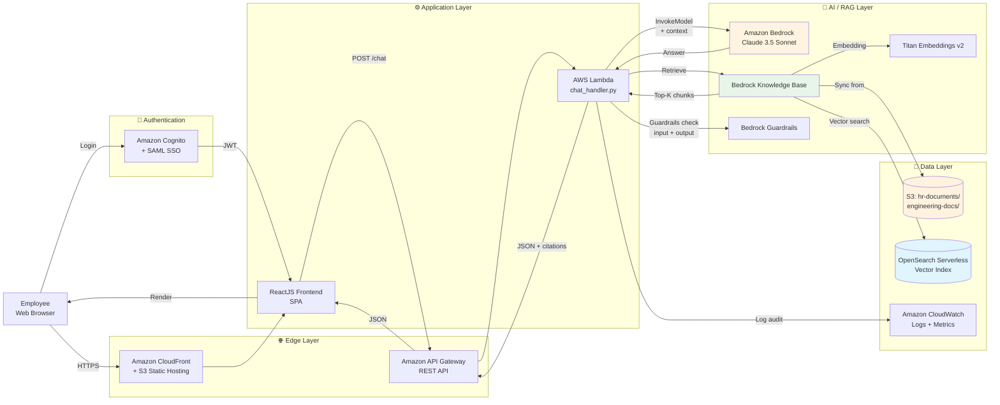

---
title: "Proposal"
date: 2026-04-12
weight: 2
chapter: false
pre: " <b> 2. </b> "
---

# FCAJ Internal Knowledge Assistant  
## Enterprise Internal Document Q&A Chatbot on AWS Bedrock

---

### 1. Executive Summary

The **FCAJ Internal Knowledge Assistant** is an intelligent Q&A chatbot built on **Amazon Bedrock + Bedrock Knowledge Base + Retrieval-Augmented Generation (RAG)**, serving **50–200 employees** at a **mid-sized fintech company (~120 people)** in Ho Chi Minh City. The system lets employees query **employee handbooks, HR procedures, internal technical docs, department FAQs, security and compliance policies** using natural-language questions (Vietnamese + English), instead of manually searching SharePoint, old emails, or directly asking HR.

The solution leverages **AWS serverless architecture** with **Bedrock Knowledge Base** automating the RAG pipeline (ingest → chunking → embedding → retrieval), **Amazon S3** as the document store, **OpenSearch Serverless** as the vector database, **AWS Lambda + API Gateway** as the backend, **CloudFront + S3** hosting a ReactJS frontend, and **Bedrock Guardrails** for **Responsible AI** (PII filtering, sensitive content blocking, prompt-injection protection). User authentication runs through **Amazon Cognito** with **SAML SSO** integrated into the company's Google Workspace.

Target KPIs:

* **70% reduction** in internal-document lookup time (from ~15 min to ~4 min per query).
* **≥ 85%** of questions answered by the chatbot without HR escalation.
* **≥ 90%** employee satisfaction after 1 month in production.
* Operating cost **≤ $50/month** (for all 120 users).

### 2. Problem Statement

#### Current State

According to an internal survey in March 2026 with 45 employees:

* **68%** of employees lose an **average of 15–30 minutes per day** looking up information (OT policy, leave procedure, security policy, onboarding guide…).
* **Internal documents are scattered** across **6 sources**: SharePoint (40%), Google Drive (25%), Confluence (15%), forwarded emails (10%), Slack pinned messages (5%), PDFs on HR laptop (5%).
* **3 out of 10 internal questions** cannot find an answer, or receive a **wrong** answer from outdated policies.
* The **HR team spends ~25% of working hours** answering recurring questions (C&B, leave policy, OT rules…) — opportunity cost estimated at **~$7,500/year**.
* When new employees onboard, **HR spends 4–6 hours per person** walking them through policies — not scalable as the company grows.

#### Proposed Solution

Build the **FCAJ Internal Knowledge Assistant** — an AWS-powered RAG chatbot — with the following core features:

| Feature | Description |
|---|---|
| **Natural-language Q&A** | Ask "What's the weekend OT policy?" → get an answer with source links |
| **Citations** | Each answer includes a link to the original document and specific page for traceability |
| **Multi-language support** | Vietnamese answers for Vietnamese questions, English answers for English questions |
| **Multi-department** | HR, Engineering, Sales, Finance — each department has its own document namespace |
| **Authentication & Authorization** | Cognito + SAML SSO; role-based access (Employee / Manager / HR Admin) |
| **Guardrails** | Filter PII (national ID, bank account), sensitive content, prompt injection |
| **Audit log** | Log every Q&A pair into CloudWatch + S3 for compliance audit (90-day retention) |
| **Feedback loop** | User votes 👍/👎 → feedback data used to fine-tune prompts and measure quality |

#### Benefits & ROI

| Item | Today | After launch | Savings |
|---|---|---|---|
| Avg lookup time / employee / day | 22 min | 6 min | **16 min × 120 users × 22 days ≈ 700 hours/month** |
| HR hours answering recurring questions | ~80 hr/month | ~15 hr/month | **65 hr/month × $15/hr ≈ $975/month** |
| Avg onboarding time | 5 hr/person | 2 hr/person | **3 hr × ~8 onboardings/month = 24 hr/month** |
| AWS infrastructure cost | $0 | ~$42/month | (see Section 6) |

**Estimated total savings: ~$1,400/month**  
**ROI: payback within 4–5 months** (excluding developer labor, since this is a workshop project).

### 3. Solution Architecture

The system applies an **AWS serverless architecture** combined with a **RAG pipeline** to provide flexible scalability for 50–200 users while optimizing operating cost (pay only for what you use).

#### AWS Services Used

| Service | Role | Why we chose it |
|---|---|---|
| **Amazon Bedrock (Claude 3.5 Sonnet)** | LLM generating answers | Strong semantic understanding, Vietnamese + English, low latency |
| **Bedrock Knowledge Base** | Manage RAG pipeline (ingest → chunk → embed → retrieve) | Fully-managed; no need to write chunking/embedding ourselves |
| **Bedrock Guardrails** | Filter PII, sensitive content, prompt injection | Meets Responsible AI & internal compliance |
| **Titan Embeddings v2** | Embed documents & questions into 1024-dim vectors | Cost-effective, multilingual |
| **Amazon OpenSearch Serverless** | Vector database for semantic search | Bedrock KB compatible, scales on demand |
| **Amazon S3** | Store source documents (PDF/DOCX/MD) | 11-nines durability, event trigger for KB sync |
| **AWS Lambda** | Process chat requests, orchestrate RAG flow | Pay-per-use, scales with traffic |
| **Amazon API Gateway** | REST endpoint for frontend | Built-in throttling, JWT authorizer integrates with Cognito |
| **Amazon CloudFront + S3** | Host ReactJS SPA | Global CDN, static caching |
| **Amazon Cognito + SAML SSO** | Authentication, federate with Google Workspace | Reuse company user pool, no password management |
| **Amazon CloudWatch** | Logs, metrics, audit trail | Trace requests, measure latency, retain audit 90 days |
| **AWS Budgets + Cost Explorer** | Monitor operating cost | Alert when over $50/month |

#### Component Design

**Ingestion Layer:**

* Source documents (PDF handbook, DOCX procedures, Markdown policies) are **uploaded to S3 bucket `hr-documents`** under per-department prefixes (`hr/`, `engineering/`, `sales/`…).
* S3 Event Notification triggers **Bedrock Knowledge Base sync job** whenever a new file is added.
* Knowledge Base automatically: **semantic chunking → embedding (Titan v2) → store in OpenSearch Serverless vector index**.
* Sync cadence: **on-demand + daily cron at 02:00 SAIGON** (full re-sync to catch content updates).

**Retrieval Layer:**

* User submits a question via ReactJS frontend → POST `/chat` to API Gateway.
* Lambda `chat_handler`:
  1. **Guardrails check input**: filter PII, prompt injection.
  2. **Embed the question** using Titan Embeddings v2.
  3. **Vector search** on OpenSearch → return **top-K=5 most relevant chunks**.
  4. **Build prompt** with context from chunks + system prompt (role: "FCAJ's HR assistant").
  5. **Invoke Bedrock Claude 3.5 Sonnet** with prompt + context.
  6. **Guardrails check output**: filter answers containing PII / violating content.
  7. **Return JSON**: `{answer, citations: [{doc_id, page, excerpt}], confidence}`.

**Security & Compliance Layer:**

* **Authentication**: Cognito User Pool + SAML 2.0 federation with Google Workspace SSO.
* **Authorization**: Lambda validates JWT claims → role-based access (`employee` / `manager` / `hr_admin`); sensitive documents (salary, M&A) restricted to `hr_admin`.
* **Encryption**: S3 + OpenSearch + Bedrock all use **AWS KMS Customer Managed Key (CMK)**.
* **Audit log**: Every request/response (PII-masked) written to CloudWatch + S3 archive, 90-day retention.

**Monitoring & Operations Layer:**

* CloudWatch Dashboard: daily Q&A volume, average latency, token usage, error rate, top queries.
* CloudWatch Alarm: notify Slack when latency > 5s, error rate > 5%, or cost > $50/month.
* Cost allocation tag `Project=FCAJ-KnowledgeAssistant` on every resource.

### 4. Technical Implementation

#### Implementation Phases

The project is split into **3 main phases**, mapped 1:1 with the 12 workshop weeks:

| Phase | Weeks | Content | Output |
|---|---|---|---|
| **Phase 1: Foundation & Data Layer** | Wk 1–3 | Study Bedrock + Knowledge Base; set up S3, OpenSearch, IAM roles; import 50 pilot docs (HR handbook) | KB operational, queryable via console |
| **Phase 2: Backend & Frontend** | Wk 4–8 | Write Lambda `chat_handler`; build API Gateway + Cognito; develop ReactJS UI (chat window, citation panel, feedback); integrate Guardrails | End-to-end chatbot running on staging |
| **Phase 3: Security, Testing & Launch** | Wk 9–12 | Penetration test, load test (200 concurrent users); Guardrails fine-tuning; write deployment guide; pilot with 30 HR + Engineering users | Go-live production, training for 120 users |

#### Technical Requirements

**AWS knowledge required:**

* **Amazon Bedrock**: proficient with Knowledge Base API, Guardrails config, model invocation (Claude 3.5 Sonnet + Titan Embeddings).
* **OpenSearch Serverless**: collection, index, vector field, network policy.
* **AWS Lambda + API Gateway**: REST API, JWT authorizer, custom authorizer with Cognito.
* **Amazon Cognito**: User Pool, Identity Pool, SAML 2.0 federation, custom attributes.
* **Amazon S3**: bucket policy, event notification, lifecycle, KMS encryption.
* **AWS IAM**: least-privilege role per service, policies for Bedrock + OpenSearch.
* **CloudWatch**: log groups, metrics, alarms, dashboards.
* **CloudFormation/CDK**: infrastructure-as-code (prefer CDK with TypeScript).

**Development tooling:**

* **Backend**: Python 3.12 (Boto3 SDK), Lambda Powertools.
* **Frontend**: ReactJS 18 + Vite + TypeScript, TailwindCSS, shadcn/ui.
* **Testing**: pytest (backend), Vitest + React Testing Library (frontend), k6 (load test).
* **CI/CD**: GitHub Actions — build → test → deploy to staging via `cdk deploy`, manual approval → production.
* **Task management**: Jira board (Scrum), 2-week sprints.

**Non-technical requirements:**

* Coordinate with **HR department** to standardize and clean source documents (remove outdated info, update new policies).
* Get **CISO approval** for storing sensitive data on AWS (Singapore region, encrypt at rest + in transit).
* **Training for 120 employees**: one 30-min online session + one short 5-min tutorial video.
* Build **incident-handling runbook** for IT helpdesk.

### 5. Roadmap & Milestones

| Milestone | Date | Acceptance Criteria |
|---|---|---|
| **M0: Project kickoff** | 12/04/2026 | Kickoff meeting, scope agreed, team assigned |
| **M1: Knowledge Base operational** | 03/05/2026 | KB successfully syncs 50 pilot documents; manual console queries return correct results |
| **M2: Backend MVP** | 24/05/2026 | Lambda + API Gateway + Cognito running; Postman tests pass |
| **M3: Frontend MVP** | 14/06/2026 | ReactJS chat UI complete; backend integration; citations displayed |
| **M4: Guardrails + Security** | 05/07/2026 | Guardrails filter 100% of PII test cases; penetration test pass |
| **M5: Load test & Polish** | 12/07/2026 | Handle 200 concurrent users; p95 latency < 5s; cost < $50/month |
| **M6: Pilot & Go-live** | 26/07/2026 | 30-user pilot for 1 week → ≥ 80% positive feedback → rollout to 120 users |
| **M7: Handover & Documentation** | 09/08/2026 | Source code, deployment guide, runbook handed over to IT Operations |

### 6. Budget Estimation

See the cost estimate on [AWS Pricing Calculator](https://calculator.aws/#/) (estimate link will be updated after final sizing).

#### Monthly Infrastructure Cost

| Service | Configuration | Cost/month (USD) |
|---|---|---|
| Amazon Bedrock (Claude 3.5 Sonnet) | ~50K input tokens + 30K output tokens/day | $18.00 |
| Bedrock Knowledge Base (queries) | ~300 queries/day × 30 = 9,000 | $1.50 |
| Titan Embeddings v2 | Re-index monthly + 9,000 queries | $0.80 |
| Bedrock Guardrails | ~9,000 requests | $1.80 |
| Amazon OpenSearch Serverless | 2 OCU Search + 2 OCU Index (auto-scale-down when idle) | $12.00 |
| Amazon S3 (documents + logs) | 20 GB storage + 50,000 requests | $1.20 |
| AWS Lambda | ~270K invocations × 512 MB × 3s avg | $0.40 |
| Amazon API Gateway | 270,000 REST requests | $0.90 |
| Amazon CloudFront | 50 GB transfer out + 3M requests | $4.50 |
| Amazon Cognito | 120 MAU (free tier 50K MAU) | $0.00 |
| CloudWatch Logs + Metrics | 20 GB ingestion + 50 metrics | $2.00 |
| Data transfer out (non-CF) | 2 GB | $0.18 |
| **Total** | | **≈ $43.28 / month** |

#### One-time Cost

| Item | Cost (USD) |
|---|---|
| Training materials & onboarding video | $0 (in-house) |
| Design software (Figma, Canva) | $0 (free tier) |
| Pilot gift cards (30 users × $5) | $150 |
| **Total** | **$150** |

#### Total 12-month Cost

* **Infrastructure**: $43.28 × 12 = **$519.36**
* **One-time**: **$150**
* **Grand total**: **~$670 / year**

### 7. Risk Assessment

#### Risk Matrix

| # | Risk | Probability | Impact | Severity |
|---|---|---|---|---|
| R1 | **Hallucination** — LLM gives wrong information | Medium | High | **High** |
| R2 | **PII leakage** via answers (national ID, bank account…) | Low | Very high | **High** |
| R3 | **Prompt injection** by malicious users | Medium | Medium | **Medium** |
| R4 | **Cost overrun** from traffic spike | Low | Medium | **Medium** |
| R5 | **AWS region outage** | Very low | High | **Low** |
| R6 | **Source documents inaccurate / outdated** | Medium | Medium | **Medium** |
| R7 | **Insufficient adoption** from employees | Medium | Medium | **Medium** |
| R8 | **OpenSearch Serverless burns OCU unexpectedly** | High | Medium | **High** |

#### Mitigation Strategies

| Risk | Mitigation |
|---|---|
| **R1 - Hallucination** | (a) Require every answer to include **citation** to source doc; (b) Add system prompt "Only answer based on provided context; if you don't know, say 'I couldn't find this information in the documents'"; (c) Confidence score < 0.7 → display disclaimer "Please confirm with HR" |
| **R2 - PII leakage** | (a) Enable **Guardrails PII filter** (block national ID, bank account, email, phone); (b) Mask PII before audit logging; (c) Penetration test by Security team |
| **R3 - Prompt injection** | (a) **Guardrails content filter** + custom denied topics; (b) Input length limit 500 tokens; (c) Rate limit 30 queries/user/hour |
| **R4 - Cost overrun** | (a) **AWS Budgets alert** at 50%, 80%, 100% of $50/month threshold; (b) Cost allocation tag; (c) Daily Cost Explorer check |
| **R5 - AWS outage** | Multi-AZ deployment (Bedrock, Lambda, OpenSearch); backup docs in Singapore region (ap-southeast-1) + DR plan |
| **R6 - Outdated docs** | (a) Document review workflow before upload to S3 (1 person uploads, 1 person verifies); (b) Document version tracked in S3 metadata; (c) Quarterly review schedule |
| **R7 - Low adoption** | (a) Onboarding training session; (b) Gamification — "Chatbot Hero of the Month"; (c) Feedback button in UI; (d) Slack notification when new features ship |
| **R8 - OpenSearch OCU** | (a) Set OpenSearch collection to **dev tier** for non-prod; (b) Schedule auto-delete collection outside business hours; (c) Tag `AutoStop=true` for easy cleanup |

#### Contingency Plan

* **If chatbot quality < 80% accuracy**: rollback to **keyword-search-only version** (Amazon Kendra or OpenSearch BM25) while continuing to improve RAG.
* **If AWS Bedrock has an incident**: temporarily switch to **keyword search** on S3 + CloudSearch.
* **If cost > $80/month**: (a) reduce top-K from 5 → 3; (b) use a smaller model (Claude 3 Haiku) for simple queries; (c) enable 24-hour response caching.
* **If users complain about quality**: organize **feedback session every 2 weeks** with 5–10 power users, use feedback to fine-tune prompts and expand KB.

### 8. Expected Outcomes

#### Technical Improvements

* **70% reduction** in internal-document lookup time (from 15 min to 4 min per query).
* **Automate 85%** of recurring internal questions → free up ~65 HR hours/month.
* **Scalable system** to 500+ users without architectural changes (only increase OpenSearch OCU).
* **Foundation for further AI use cases**: ticket classification, email auto-reply, contract analysis, internal Q&A for engineering docs.

#### Long-term Value

* **Digitized knowledge asset**: all company documents indexed with semantic search; no "knowledge loss" when employees leave.
* **AI-first workplace foundation**: this is the company's first AI chatbot, paving the way for other AI projects (Bedrock Agents with Action Groups, multi-agent orchestration).
* **Lessons learned**: provides a pattern for similar fintech companies to deploy the same solution.
* **Research opportunities**: Q&A data (after PII masking) can be used for **RAG evaluation, prompt engineering, hallucination detection** research — aligned with the project's academic interests.

#### Contribution to FCAJ Workshop

* This **real-world use case** gives the workshop additional reference material when teaching Bedrock Knowledge Base.
* We can **publish a blog on the workshop site** after completion (3 blogs on document processing already exist).
* We can **contribute CDK templates** to the FCAJ open-source community.