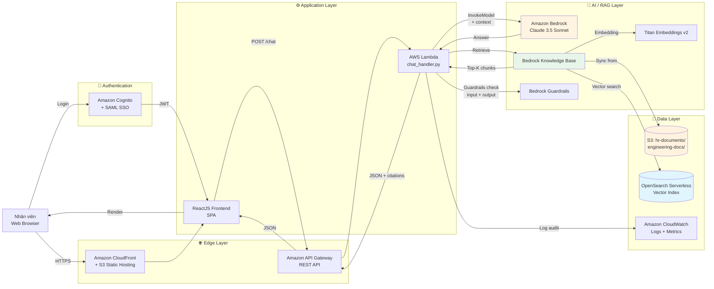

---
title: "Bản đề xuất"
date: 2026-04-12
weight: 2
chapter: false
pre: " <b> 2. </b> "
---
# FCAJ Internal Knowledge Assistant  
## Chatbot RAG tra cứu tài liệu nội bộ doanh nghiệp trên AWS Bedrock

---

### 1. Tóm tắt điều hành

**FCAJ Internal Knowledge Assistant** là một chatbot hỏi-đáp thông minh được xây dựng trên **Amazon Bedrock + Bedrock Knowledge Base + Retrieval-Augmented Generation (RAG)**, phục vụ **50–200 nhân viên** trong **một công ty fintech cỡ vừa (≈120 người)** tại TP.HCM. Hệ thống cho phép nhân viên tra cứu **employee handbook, quy trình HR, tài liệu kỹ thuật nội bộ, FAQ phòng ban, policy bảo mật và compliance** thông qua câu hỏi bằng ngôn ngữ tự nhiên (tiếng Việt + tiếng Anh), thay vì phải tìm kiếm thủ công trên SharePoint, email cũ hay hỏi trực tiếp phòng HR.

Giải pháp tận dụng **kiến trúc serverless trên AWS** với **Bedrock Knowledge Base** tự động hoá pipeline RAG (ingest → chunking → embedding → retrieval), **Amazon S3** làm kho tài liệu, **OpenSearch Serverless** làm vector database, **AWS Lambda + API Gateway** làm backend, **CloudFront + S3** host frontend ReactJS, và **Bedrock Guardrails** đảm bảo **Responsible AI** (lọc PII, nội dung nhạy cảm, prompt injection). Xác thực người dùng qua **Amazon Cognito** với **SAML SSO** tích hợp vào hệ thống Google Workspace của công ty.

Mục tiêu KPI:

* **Giảm 70%** thời gian tra cứu tài liệu nội bộ (từ ~15 phút xuống ~4 phút/câu hỏi).
* **≥ 85%** câu trả lời được chatbot phản hồi thành công mà không cần chuyển tiếp cho HR.
* **≥ 90%** độ hài lòng của nhân viên sau 1 tháng vận hành.
* Chi phí vận hành **≤ $50/tháng** (toàn bộ 120 users).

### 2. Tuyên bố vấn đề

#### Vấn đề hiện tại

Theo khảo sát nội bộ trong tháng 3/2026 với 45 nhân viên:

* **68%** nhân viên cho biết mất **trung bình 15–30 phút/ngày** để tra cứu thông tin (chính sách OT, quy trình nghỉ phép, policy bảo mật, hướng dẫn onboarding…).
* **Tài liệu nội bộ phân tán** ở **6 nguồn khác nhau**: SharePoint (40%), Google Drive (25%), Confluence (15%), email forwarded (10%), Slack pinned message (5%), PDF in HR laptop (5%).
* **3 trong 10 câu hỏi nội bộ** không tìm được câu trả lời hoặc nhận câu trả lời **sai lệch** do đọc policy cũ.
* Phòng **HR mất ~25% thời gian làm việc** để trả lời các câu hỏi lặp lại (C&B, leave policy, OT rule…) — ước tính chi phí cơ hội ~ **180 triệu VNĐ/năm**.
* Khi nhân viên mới onboard, **HR phải dành 4–6 tiếng/người** để giới thiệu policy — không scale khi công ty tuyển thêm.

#### Giải pháp

Xây dựng **FCAJ Internal Knowledge Assistant** — chatbot RAG chạy trên AWS — với các tính năng chính:

| Tính năng | Mô tả |
|---|---|
| **Hỏi-đáp bằng ngôn ngữ tự nhiên** | Hỏi "Chính sách OT cuối tuần như thế nào?" → nhận câu trả lời kèm link nguồn |
| **Trích dẫn nguồn (citation)** | Mỗi câu trả lời đính kèm link đến tài liệu gốc & trang cụ thể, đảm bảo traceability |
| **Hỗ trợ đa ngôn ngữ** | Trả lời tiếng Việt cho câu hỏi tiếng Việt, tiếng Anh cho câu hỏi tiếng Anh |
| **Hỗ trợ đa phòng ban** | HR, Engineering, Sales, Finance — mỗi phòng ban có namespace tài liệu riêng |
| **Authentication & Authorization** | Cognito + SAML SSO; phân quyền truy cập theo role (Employee / Manager / HR Admin) |
| **Guardrails** | Lọc PII (CMND, số tài khoản), nội dung nhạy cảm, prompt injection |
| **Audit log** | Lưu log mọi câu hỏi/đáp vào CloudWatch + S3 để compliance audit (90 ngày) |
| **Feedback loop** | User vote 👍/👎 → dữ liệu feedback dùng để fine-tune prompt và đánh giá chất lượng |

#### Lợi ích và hoàn vốn đầu tư (ROI)

| Hạng mục | Hiện tại | Sau triển khai | Tiết kiệm |
|---|---|---|---|
| Thời gian tra cứu TB/ngày/nhân viên | 22 phút | 6 phút | **16 phút × 120 users × 22 ngày = ~700 giờ/tháng** |
| Giờ HR trả lời câu hỏi lặp lại | ~80 giờ/tháng | ~15 giờ/tháng | **65 giờ/tháng × $15/giờ ≈ $975/tháng** |
| Thời gian onboarding trung bình | 5 giờ/người | 2 giờ/người | **3 giờ × ~8 onboarding/tháng = 24 giờ/tháng** |
| Chi phí hạ tầng AWS | $0 | ~$42/tháng | (đã tính ở phần 6) |

**Tổng tiết kiệm ước tính: ~$1,400/tháng (≈ 35 triệu VNĐ)**  
**ROI: hoàn vốn trong vòng 4–5 tháng** (không tính chi phí nhân sự dev vì đây là workshop project).

### 3. Kiến trúc giải pháp

Hệ thống áp dụng **kiến trúc AWS Serverless** kết hợp **RAG pipeline** để cung cấp khả năng mở rộng linh hoạt cho 50–200 users, đồng thời tối ưu chi phí vận hành (chỉ trả tiền khi sử dụng).

#### Dịch vụ AWS sử dụng

| Service | Vai trò | Lý do chọn |
|---|---|---|
| **Amazon Bedrock (Claude 3.5 Sonnet)** | LLM sinh câu trả lời | Hiểu ngữ nghĩa tốt, hỗ trợ tiếng Việt + tiếng Anh, latency thấp |
| **Bedrock Knowledge Base** | Quản lý pipeline RAG (ingest → chunk → embed → retrieve) | Fully-managed, không cần tự viết chunking/embedding pipeline |
| **Bedrock Guardrails** | Lọc PII, nội dung nhạy cảm, prompt injection | Đáp ứng Responsible AI & compliance nội bộ |
| **Titan Embeddings v2** | Embed tài liệu & câu hỏi thành vector 1024-dim | Cost-effective, multilingual support |
| **Amazon OpenSearch Serverless** | Vector database cho semantic search | Tương thích Bedrock KB, scale theo nhu cầu |
| **Amazon S3** | Lưu trữ tài liệu nguồn (PDF/DOCX/MD) | 11 nines durability, trigger event tự động sync KB |
| **AWS Lambda** | Xử lý chat request, orchestrate RAG flow | Pay-per-use, scale theo traffic |
| **Amazon API Gateway** | REST endpoint cho frontend | Throttler built-in, JWT authorizer tích hợp Cognito |
| **Amazon CloudFront + S3** | Host SPA ReactJS | CDN toàn cầu, cache tĩnh |
| **Amazon Cognito + SAML SSO** | Authentication, federate với Google Workspace | Tận dụng user pool công ty, không quản lý password |
| **Amazon CloudWatch** | Logs, metrics, audit trail | Trace request, đo latency, lưu audit 90 ngày |
| **AWS Budgets + Cost Explorer** | Giám sát chi phí vận hành | Alert khi vượt $50/tháng |

#### Thiết kế thành phần

**Lớp thu thập & xử lý tài liệu (Ingestion):**

* Tài liệu nguồn (PDF handbook, DOCX quy trình, Markdown policy) được **upload lên S3 bucket `hr-documents`** theo cấu trúc prefix theo phòng ban (`hr/`, `engineering/`, `sales/`…).
* S3 Event Notification trigger **Bedrock Knowledge Base sync job** mỗi khi có file mới.
* Knowledge Base tự động: **chunking (semantic) → embedding (Titan v2) → lưu vào OpenSearch Serverless vector index**.
* Tần suất sync: **on-demand + daily cron 02:00 SAIGON** (sync toàn bộ để bắt cập nhật nội dung).

**Lớp truy vấn (Retrieval):**

* User gửi câu hỏi qua ReactJS frontend → POST `/chat` đến API Gateway.
* Lambda `chat_handler`:
  1. **Guardrails check input**: lọc PII, prompt injection.
  2. **Embed câu hỏi** bằng Titan Embeddings v2.
  3. **Vector search** trên OpenSearch → trả về **top-K=5 chunks** liên quan nhất.
  4. **Build prompt** với context từ chunks + system prompt (role: "HR assistant của công ty FCAJ").
  5. **Invoke Bedrock Claude 3.5 Sonnet** với prompt + context.
  6. **Guardrails check output**: lọc câu trả lời có PII / nội dung vi phạm.
  7. **Trả về JSON**: `{answer, citations: [{doc_id, page, excerpt}], confidence}`.

**Lớp bảo mật & compliance:**

* **Authentication**: Cognito User Pool + SAML 2.0 federation với Google Workspace SSO.
* **Authorization**: Lambda kiểm tra JWT claims → phân quyền theo role (`employee` / `manager` / `hr_admin`); một số tài liệu nhạy cảm (lương, M&A) chỉ `hr_admin` truy cập được.
* **Encryption**: S3 + OpenSearch + Bedrock đều dùng **AWS KMS Customer Managed Key** (CMK).
* **Audit log**: Toàn bộ request/response (ẩn PII) ghi vào CloudWatch + archive S3 với retention 90 ngày.

**Lớp giám sát & vận hành:**

* CloudWatch Dashboard: số lượng câu hỏi/ngày, latency trung bình, token usage, error rate, top câu hỏi.
* CloudWatch Alarm: thông báo Slack khi latency > 5s, error rate > 5%, hoặc chi phí vượt $50/tháng.
* Cost allocation tag `Project=FCAJ-KnowledgeAssistant` trên mọi resource.

### 4. Triển khai kỹ thuật

#### Các giai đoạn triển khai

Dự án chia thành **3 giai đoạn chính**, mapping 1:1 với 12 tuần workshop:

| Giai đoạn | Thời gian | Nội dung | Output |
|---|---|---|---|
| **GĐ1: Foundation & Data Layer** | Tuần 1–3 | Nghiên cứu Bedrock + Knowledge Base; chuẩn bị S3, OpenSearch, IAM roles; import 50 tài liệu pilot (HR handbook) | KB hoạt động, có thể truy vấn thử qua console |
| **GĐ2: Backend & Frontend** | Tuần 4–8 | Viết Lambda `chat_handler`; build API Gateway + Cognito; develop ReactJS UI (chat window, citation panel, feedback); tích hợp Guardrails | Chatbot end-to-end chạy được trên staging |
| **GĐ3: Security, Testing & Launch** | Tuần 9–12 | Penetration test, load test (200 users đồng thời); Guardrails fine-tuning; viết deployment guide; pilot với 30 users phòng HR + Engineering | Go-live production, training cho 120 users |

#### Yêu cầu kỹ thuật

**Kiến thức AWS cần thiết:**

* **Amazon Bedrock**: thành thạo Knowledge Base API, Guardrails config, model invocation (Claude 3.5 Sonnet + Titan Embeddings).
* **OpenSearch Serverless**: collection, index, vector field, network policy.
* **AWS Lambda + API Gateway**: REST API, JWT authorizer, custom authorizer với Cognito.
* **Amazon Cognito**: User Pool, Identity Pool, SAML 2.0 federation, custom attributes.
* **Amazon S3**: bucket policy, event notification, lifecycle, KMS encryption.
* **AWS IAM**: least-privilege role cho từng service, policy cho Bedrock + OpenSearch.
* **CloudWatch**: log groups, metrics, alarms, dashboards.
* **CloudFormation/CDK**: infrastructure-as-code (ưu tiên CDK với TypeScript).

**Công cụ phát triển:**

* **Backend**: Python 3.12 (Boto3 SDK), Lambda Powertools.
* **Frontend**: ReactJS 18 + Vite + TypeScript, TailwindCSS, shadcn/ui.
* **Testing**: pytest (backend), Vitest + React Testing Library (frontend), k6 (load test).
* **CI/CD**: GitHub Actions — build → test → deploy lên staging qua `cdk deploy`, manual approval → production.
* **Quản lý task**: Jira board theo Scrum, sprint 2 tuần.

**Yêu cầu phi kỹ thuật:**

* Phối hợp với **phòng HR** để chuẩn hoá & làm sạch tài liệu nguồn (xoá thông tin lỗi thời, cập nhật policy mới).
* Nhận **phê duyệt từ CISO** về việc lưu trữ dữ liệu nhạy cảm trên AWS (region Singapore, encrypt at rest + in transit).
* **Training cho 120 nhân viên**: 1 buổi 30 phút online + 1 video hướng dẫn ngắn 5 phút.
* Xây dựng **runbook xử lý sự cố** cho IT helpdesk.

### 5. Lộ trình & Mốc triển khai

| Mốc (Milestone) | Thời gian | Tiêu chí thành công (Acceptance Criteria) |
|---|---|---|
| **M0: Khởi động dự án** | 12/04/2026 | Kickoff meeting, thống nhất scope, phân công team |
| **M1: Knowledge Base hoạt động** | 03/05/2026 | KB sync thành công 50 tài liệu pilot; truy vấn thử qua console cho kết quả đúng |
| **M2: Backend MVP** | 24/05/2026 | Lambda + API Gateway + Cognito chạy được; test qua Postman thành công |
| **M3: Frontend MVP** | 14/06/2026 | ReactJS chat UI hoàn chỉnh; kết nối backend; hiển thị citation |
| **M4: Guardrails + Security** | 05/07/2026 | Guardrails lọc PII thành công 100% test cases; penetration test pass |
| **M5: Load test & Polish** | 12/07/2026 | Chịu tải 200 concurrent users; p95 latency < 5s; cost < $50/tháng |
| **M6: Pilot & Go-live** | 26/07/2026 | 30 users pilot dùng 1 tuần → feedback ≥ 80% positive → rollout 120 users |
| **M7: Handover & Documentation** | 09/08/2026 | Bàn giao source code, deployment guide, runbook cho IT Operations |

### 6. Ước tính ngân sách

Có thể xem chi phí trên [AWS Pricing Calculator](https://calculator.aws/#/) (link estimate sẽ được cập nhật sau khi final sizing).

#### Chi phí hạ tầng hàng tháng

| Service | Cấu hình | Chi phí/tháng (USD) |
|---|---|---|
| Amazon Bedrock (Claude 3.5 Sonnet) | ~50.000 input tokens + 30.000 output tokens/ngày | $18.00 |
| Bedrock Knowledge Base (queries) | ~300 queries/ngày × 30 ngày = 9.000 | $1.50 |
| Titan Embeddings v2 | Re-index monthly + 9.000 queries | $0.80 |
| Bedrock Guardrails | ~9.000 requests | $1.80 |
| Amazon OpenSearch Serverless | 2 OCU Search + 2 OCU Index (auto-scale-down khi idle) | $12.00 |
| Amazon S3 (documents + logs) | 20 GB storage + 50.000 requests | $1.20 |
| AWS Lambda | ~270.000 invocations × 512 MB × 3s avg | $0.40 |
| Amazon API Gateway | 270.000 REST requests | $0.90 |
| Amazon CloudFront | 50 GB transfer out + 3.000.000 requests | $4.50 |
| Amazon Cognito | 120 MAU (free tier 50K MAU) | $0.00 |
| CloudWatch Logs + Metrics | 20 GB ingestion + 50 metrics | $2.00 |
| Data transfer out (không qua CF) | 2 GB | $0.18 |
| **Tổng cộng** | | **≈ $43.28 / tháng** |

#### Chi phí một lần

| Hạng mục | Chi phí (USD) |
|---|---|
| Tài liệu training & video onboarding | $0 (làm nội bộ) |
| Phần mềm thiết kế (Figma, Canva) | $0 (dùng bản miễn phí) |
| Pilot gift card (30 users × $5) | $150 |
| **Tổng cộng** | **$150** |

#### Tổng chi phí 12 tháng

* **Hạ tầng**: $43.28 × 12 = **$519.36**
* **Một lần**: **$150**
* **Grand total**: **~$670 / năm** (≈ 16 triệu VNĐ)

### 7. Đánh giá rủi ro

#### Ma trận rủi ro

| # | Rủi ro | Xác suất | Tác động | Mức độ |
|---|---|---|---|---|
| R1 | **Hallucination** — LLM trả lời sai thông tin | Trung bình | Cao | **Cao** |
| R2 | **Lộ PII** qua câu trả lời (CMND, số tài khoản…) | Thấp | Rất cao | **Cao** |
| R3 | **Prompt injection** từ user cố tình | Trung bình | Trung bình | **Trung bình** |
| R4 | **Chi phí vượt ngân sách** do traffic spike | Thấp | Trung bình | **Trung bình** |
| R5 | **AWS region outage** | Rất thấp | Cao | **Thấp** |
| R6 | **Tài liệu nguồn sai lệch / lỗi thời** | Trung bình | Trung bình | **Trung bình** |
| R7 | **Không đủ adoption** từ nhân viên | Trung bình | Trung bình | **Trung bình** |
| R8 | **OpenSearch Serverless tốn OCU ngoài ý muốn** | Cao | Trung bình | **Cao** |

#### Chiến lược giảm thiểu

| Rủi ro | Biện pháp |
|---|---|
| **R1 - Hallucination** | (a) Bắt buộc mọi câu trả lời có **citation** đến doc gốc; (b) Thêm system prompt "Chỉ trả lời dựa trên context được cung cấp, nếu không biết hãy nói 'Tôi không tìm thấy thông tin này trong tài liệu'"; (c) Confidence score < 0.7 → hiển thị disclaimer "Vui lòng xác nhận với HR" |
| **R2 - Lộ PII** | (a) Bật **Guardrails PII filter** (chặn CMND, số tài khoản, email, phone); (b) Mask PII trước khi log audit; (c) Penetration test bởi team Security |
| **R3 - Prompt injection** | (a) **Guardrails content filter** + custom denied topics; (b) Input length limit 500 tokens; (c) Rate limit 30 queries/user/giờ |
| **R4 - Chi phí vượt** | (a) **AWS Budgets alert** ở 50%, 80%, 100% ngưỡng $50/tháng; (b) Cost allocation tag; (c) Daily Cost Explorer check |
| **R5 - AWS outage** | Multi-AZ deployment (Bedrock, Lambda, OpenSearch); backup tài liệu ở region Singapore (ap-southeast-1) + DR plan |
| **R6 - Tài liệu sai** | (a) Quy trình review tài liệu trước khi upload S3 (1 người upload, 1 người verify); (b) Phiên bản tài liệu được track trong S3 metadata; (c) Ngày review định kỳ mỗi quý |
| **R7 - Không đủ adoption** | (a) Training buổi onboarding; (b) Gamification — "Chatbot Hero of the Month"; (c) Feedback button trong UI; (d) Slack notification khi có tính năng mới |
| **R8 - OpenSearch OCU** | (a) Set OpenSearch collection ở **dev tier** cho non-prod; (b) Schedule auto-delete collection ngoài giờ làm việc; (c) Tag `AutoStop=true` để dễ cleanup |

#### Kế hoạch dự phòng (Contingency Plan)

* **Nếu chatbot không đạt chất lượng (accuracy < 80%)**: rollback về **phiên bản chỉ truy vấn keyword** (Amazon Kendra hoặc OpenSearch BM25) trong khi tiếp tục cải tiến RAG.
* **Nếu AWS Bedrock gặp sự cố**: tạm chuyển sang **keyword search** trên S3 + CloudSearch.
* **Nếu cost vượt $80/tháng**: (a) giảm top-K từ 5 → 3; (b) dùng model nhỏ hơn (Claude 3 Haiku) cho query đơn giản; (c) enable response caching 24h.
* **Nếu user phàn nàn về chất lượng**: tổ chức **feedback session 2 tuần/lần** với 5–10 power users, dùng feedback để fine-tune prompt và mở rộng KB.

### 8. Kết quả kỳ vọng

#### Cải tiến kỹ thuật

* **Giảm 70%** thời gian tra cứu tài liệu nội bộ (từ 15 phút xuống 4 phút/câu hỏi).
* **Tự động hoá 85%** các câu hỏi nội bộ lặp lại → giải phóng ~65 giờ HR/tháng.
* **Hệ thống có khả năng mở rộng** lên 500+ users mà không thay đổi kiến trúc (chỉ tăng OpenSearch OCU).
* **Foundation cho các use case AI tiếp theo**: ticket classification, email auto-reply, contract analysis, internal Q&A cho engineering docs.

#### Giá trị dài hạn

* **Tài sản tri thức số hoá**: toàn bộ tài liệu công ty được index, tìm kiếm semantic, không lo "knowledge loss" khi nhân viên nghỉ việc.
* **Nền tảng cho AI-first workplace**: đây là chatbot AI đầu tiên của công ty, mở đường cho các dự án AI khác (Bedrock Agents với Action Groups, multi-agent orchestration).
* **Bài học kinh nghiệm**: cung cấp pattern cho các công ty cùng ngành fintech triển khai tương tự.
* **Cơ hội nghiên cứu**: dữ liệu câu hỏi/đáp (sau khi mask PII) có thể dùng để nghiên cứu **RAG evaluation, prompt engineering, hallucination detection** — phù hợp với định hướng học thuật của nhóm dự án.

#### Đóng góp cho FCAJ Workshop

* Đây là **use case thực tế** giúp workshop có thêm tài liệu tham khảo khi giảng dạy Bedrock Knowledge Base.
* Có thể **publish bài blog lên workshop site** sau khi hoàn thành (đã có 3 blog về document processing).
* Có thể **đóng góp CDK template** cho cộng đồng FCAJ open-source.