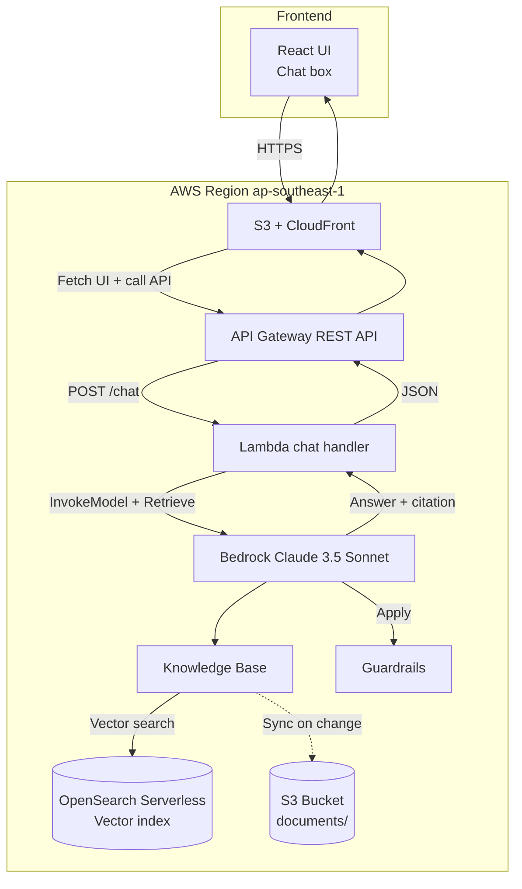

#### Introduction to Amazon Bedrock & RAG

**Amazon Bedrock** is AWS's fully-managed generative AI service that exposes many top Foundation Models (FMs) through a single API — with no ML infrastructure to manage.

* **Available Foundation Models:** Anthropic Claude 3.5 Sonnet/Haiku, Meta Llama 3, Amazon Titan (Text/Embeddings/Image), Mistral, Cohere Command, Stability AI Stable Diffusion.
* **Bedrock Knowledge Base** automates the RAG pipeline: ingest from S3 → chunking → embedding via Titan Embeddings v2 → store in OpenSearch Serverless → ready to retrieve.
* **Bedrock Agents** allow the model to autonomously plan and call tools (Lambda) for multi-step tasks.
* **Bedrock Guardrails** filter harmful content, redact PII, and block prompt injections.

#### Why RAG matters

LLMs only "know" what they were trained on, and they have a knowledge cutoff. For internal company data (handbook, technical docs, FAQ), LLMs cannot answer accurately without extra context. RAG solves this by:

* **Updating knowledge in real time** without fine-tuning.
* **Reducing hallucination** by giving the model context to ground on.
* **Providing citations** so users can verify where the answer came from.
* **Keeping data secure** — internal docs are not "learned" by third-party models.

#### Workshop overview

In this workshop you will build a complete **Q&A chatbot** with three main components:

* **Cloud side (AWS):** Bedrock, OpenSearch Serverless, S3, Lambda, API Gateway, CloudFront.
* **Application side:** Lambda function handling chat requests + a simple React chat UI.
* **AI side:** Claude 3.5 Sonnet as the LLM, Titan Embeddings v2 as the embedding model, Guardrails for output filtering.

We will use **Singapore (ap-southeast-1)** because it supports Claude 3.5 + Titan Embeddings v2 + OpenSearch Serverless, and has low latency from Vietnam.

#### Workshop outcomes

You will end up with:
* A working Knowledge Base that ingests PDF/Markdown/HTML documents.
* A REST API `/chat` returning the answer + citations.
* A React chat UI running on CloudFront.
* Guardrails filtering harmful content and PII.
* A CloudWatch dashboard tracking token usage, latency, and cost.

#### References
* [Amazon Bedrock User Guide](https://docs.aws.amazon.com/bedrock/latest/userguide/what-is-bedrock.html)
* [Bedrock Knowledge Base](https://docs.aws.amazon.com/bedrock/latest/userguide/knowledge-base.html)
* [Retrieval Augmented Generation (RAG) pattern](https://docs.aws.amazon.com/prescriptive-guidance/latest/retrieval-augmented-generation-options/rag-architecture.html)
* [Amazon Titan Embeddings](https://docs.aws.amazon.com/bedrock/latest/userguide/titan-embedding-models.html)