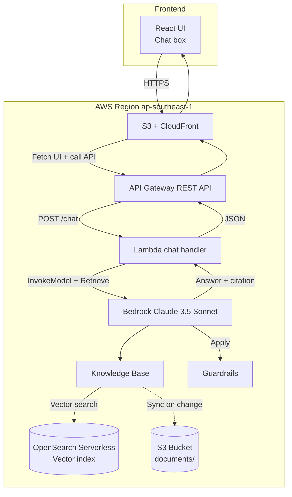

#### Giới thiệu về Amazon Bedrock & RAG

**Amazon Bedrock** là dịch vụ generative AI fully-managed của AWS, cho phép truy cập nhiều Foundation Model (FM) hàng đầu thông qua một API duy nhất, không cần quản lý hạ tầng ML.

* **Foundation Model khả dụng:** Anthropic Claude 3.5 Sonnet/Haiku, Meta Llama 3, Amazon Titan (Text/Embeddings/Image), Mistral, Cohere Command, Stability AI Stable Diffusion.
* **Bedrock Knowledge Base** tự động hoá pipeline RAG: ingest tài liệu từ S3 → chunking → embedding bằng Titan Embeddings v2 → lưu vào OpenSearch Serverless → sẵn sàng retrieve.
* **Bedrock Agents** cho phép model tự lập kế hoạch & gọi tool (Lambda) để hoàn thành tác vụ nhiều bước.
* **Bedrock Guardrails** giúp lọc nội dung có hại, ẩn thông tin cá nhân (PII) và ngăn chặn prompt injection.

#### Vì sao RAG lại quan trọng?

Các LLM mặc định chỉ "biết" những gì trong dữ liệu huấn luyện của chúng và có "kiến thức cắt" (knowledge cutoff). Đối với dữ liệu nội bộ công ty (handbook, tài liệu kỹ thuật, FAQ), LLM không thể trả lời chính xác nếu không cung cấp thêm ngữ liệu. RAG giải quyết vấn đề này bằng cách:

* **Cập nhật kiến thức real-time** không cần fine-tune model.
* **Giảm hallucination** nhờ model có ngữ liệu để tham chiếu.
* **Trích dẫn nguồn** (citation) — user có thể kiểm tra câu trả lời dựa trên tài liệu nào.
* **Bảo mật dữ liệu** — tài liệu nội bộ không bị "học" lại bởi model của bên thứ ba.

#### Tổng quan về workshop

Trong workshop này, bạn sẽ xây dựng một **chatbot hỏi-đáp** hoàn chỉết với 3 thành phần chính:

* **Cloud side (AWS):** dịch vụ Bedrock, OpenSearch Serverless, S3, Lambda, API Gateway, CloudFront.
* **Application side:** Lambda function xử lý chat request + Frontend React đơn giản (UI chat).
* **AI side:** Claude 3.5 Sonnet làm LLM, Titan Embeddings v2 làm embedding model, Guardrails lọc output.

Chúng ta sẽ dùng region **Singapore (ap-southeast-1)** vì hỗ trợ đầy đủ các model Claude 3.5 + Titan Embeddings v2 + OpenSearch Serverless, đồng thời có latency thấp từ Việt Nam.

#### Kết quả sau workshop

Bạn sẽ có:
* Một Knowledge Base hoạt động, có thể ingest tài liệu PDF/Markdown/HTML.
* REST API `/chat` trả về câu trả lời + citation.
* Frontend React chat UI chạy trên CloudFront.
* Guardrails lọc nội dung có hại & PII.
* CloudWatch dashboard theo dõi token sử dụng, latency, cost.

#### Tài liệu tham khảo
* [Amazon Bedrock User Guide](https://docs.aws.amazon.com/bedrock/latest/userguide/what-is-bedrock.html)
* [Bedrock Knowledge Base](https://docs.aws.amazon.com/bedrock/latest/userguide/knowledge-base.html)
* [Retrieval Augmented Generation (RAG) pattern](https://docs.aws.amazon.com/prescriptive-guidance/latest/retrieval-augmented-generation-options/rag-architecture.html)
* [Amazon Titan Embeddings](https://docs.aws.amazon.com/bedrock/latest/userguide/titan-embedding-models.html)