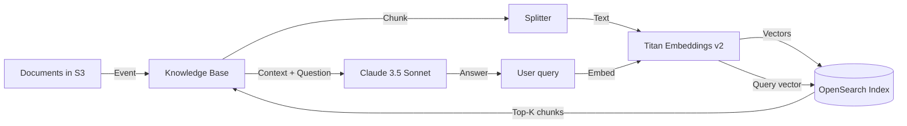

#### Overview

In this section you will create a complete **Bedrock Knowledge Base** including:

* **Vector store:** Amazon OpenSearch Serverless (collection + index)
* **Embedding model:** Amazon Titan Embeddings v2
* **Source data:** S3 bucket holding documents (PDF, Markdown, HTML, txt)
* **Chunking strategy:** default or semantic chunking (optional)

The Knowledge Base will automatically:
1. Scan the S3 bucket on a schedule
2. Split documents into chunks per the configuration
3. Generate vector embeddings with Titan Embeddings v2
4. Store them in the OpenSearch Serverless index
5. Be ready for semantic search queries



---

#### 3.1. Create the OpenSearch Serverless collection

OpenSearch Serverless requires a **collection** to store vectors. There are 3 collection types:

* **Vector search** — store embeddings, used for RAG
* **Searchable text files** — text search (we don't use)
* **Time series** — logs, metrics

Create a Vector search collection with **Standby disabled** (cost-saving for dev):

1. Open the OpenSearch Service console → **Serverless** → **Collections**.
2. Click **Create collection**, name it `kb-vector-collection`.
3. Collection type: **Vector search**.
4. Network: **Public access** (for lab/dev). Production should use VPC.
5. Create the **encryption policy** & **network policy** when prompted.
6. Click **Create** and wait until status is **Active** (~2-3 minutes).

```json
{
  "Rules": [
    { "ResourceType": "collection", "Resource": ["collection/kb-vector-collection"] }
  ],
  "AWSOwnedKey": true
}
```

#### 3.2. Create the Vector index in the collection

After the collection is Active, open it → **Indexes** tab → **Create vector index**:

* Index name: `kb-documents-index`
* Vector field: `bedrock-knowledge-base-default-vector`
* Dimensions: **1024** (the standard for Titan Embeddings v2 — DO NOT pick the wrong size, ingestion will fail)
* Distance metric: **Cosine**

```json
{
  "settings": {
    "index": { "knn": true }
  },
  "mappings": {
    "properties": {
      "bedrock-knowledge-base-default-vector": {
        "type": "knn_vector",
        "dimension": 1024,
        "method": { "name": "hnsw", "engine": "faas" }
      },
      "AMAZON_BEDROCK_METADATA": { "type": "text", "index": false },
      "AMAZON_BEDROCK_TEXT_CHUNK": { "type": "text", "index": false }
    }
  }
}
```

#### 3.3. Create the IAM role for the Knowledge Base

Bedrock needs a service role to access S3 and OpenSearch. You can let Bedrock **auto-create** the role, or create it yourself for more control.

The role policy needs 2 main actions:

```json
{
  "Version": "2012-10-17",
  "Statement": [
    {
      "Effect": "Allow",
      "Action": ["s3:GetObject", "s3:ListBucket"],
      "Resource": [
        "arn:aws:s3:::fcaj-bedrock-docs-<your-id>",
        "arn:aws:s3:::fcaj-bedrock-docs-<your-id>/*"
      ]
    },
    {
      "Effect": "Allow",
      "Action": ["aoss:APIAccessAll"],
      "Resource": ["arn:aws:aoss:ap-southeast-1:<account-id>:collection/*"]
    },
    {
      "Effect": "Allow",
      "Action": ["bedrock:InvokeModel"],
      "Resource": [
        "arn:aws:bedrock:ap-southeast-1::foundation-model/amazon.titan-embed-text-v2:0"
      ]
    }
  ]
}
```

Trust policy allowing Bedrock to assume the role:

```json
{
  "Version": "2012-10-17",
  "Statement": [
    {
      "Effect": "Allow",
      "Principal": { "Service": "bedrock.amazonaws.com" },
      "Action": "sts:AssumeRole"
    }
  ]
}
```

#### 3.4. Create the Knowledge Base

1. Open **Amazon Bedrock** console → **Knowledge bases** → **Create knowledge base**.
2. **Knowledge base details:**
   * Name: `fcaj-workshop-kb`
   * Description: "Knowledge base for FCAJ workshop chatbot"
   * IAM role: select the role from step 3.3 (or let Bedrock create one)
3. **Data source:**
   * Source: **Amazon S3**
   * S3 URI: `s3://fcaj-bedrock-docs-<your-id>/`
   * (optional) Inclusion/Exclusion filter
4. **Embedding model:**
   * Embedding model: **Titan Text Embeddings v2**
   * Dimensions: 1024
   * (V2 supports VI + EN well, default 1024 dimensions)
5. **Vector store:**
   * Choose **Amazon OpenSearch Serverless**
   * Collection & index created in steps 3.1, 3.2
   * Vector field: `bedrock-knowledge-base-default-vector`
   * Text field: `AMAZON_BEDROCK_TEXT_CHUNK`
   * Metadata field: `AMAZON_BEDROCK_METADATA`
6. Click **Create knowledge base** → wait a few tens of seconds.

#### 3.5. Configure chunking

In the Knowledge Base, go to the **Data source** tab → select the S3 source → **Edit**:

* **Chunking strategy:** choose **Default chunking**
  * Max tokens: 300 (default)
  * Overlap percentage: 20% (helps preserve context between chunks)
* Or **Fixed-size chunking** (divide by fixed token count)
* Or **Hierarchical chunking** (parent + child chunks, good for long structured docs)
* Or **Semantic chunking** (split by semantic similarity — more accurate, more expensive)


Click **Save** to apply.

#### 3.6. Sync data from S3

After configuration:

1. Go to the Knowledge Base → **Data source** tab → select the S3 source → click **Sync**.
2. Wait for **Sync complete** (a few minutes for small docs, longer for many files).
3. Switch to the **Test** tab to try queries right in the Console.

```bash
# Or use AWS CLI to sync
aws bedrock-agent start-ingestion-job \
  --knowledge-base-id <KB_ID> \
  --data-source-id <DS_ID> \
  --region ap-southeast-1
```

#### 3.7. Test the Knowledge Base right in the console

In the Bedrock console → Knowledge Base → **Test** tab:

1. Pick the model **Claude 3.5 Sonnet** in the "Select model" dropdown.
2. Enter a question: *"What is AWS Lambda?"* or *"Summarize the AWS overview document"*.
3. Click **Run**.
4. Observe:
   * **Retrieved chunks:** the relevant passages retrieved
   * **Generated answer:** Claude's reply
   * **Source attribution:** which file and chunk it came from


If the answer is correct and properly cited, you have completed the Knowledge Base part!

#### 3.8. Automatic sync on new uploads

Bedrock Knowledge Base supports 2 sync modes:

* **On-demand:** you click Sync manually (as in step 3.6)
* **Event-driven:** when an object is uploaded/deleted in S3, Bedrock syncs automatically. Enable it by:
  1. Knowledge Base → **Data source** tab → **Edit**
  2. Turn on **Auto sync on change**
  3. Bedrock auto-creates an EventBridge rule monitoring S3 events

With auto-sync, every time you `aws s3 cp file.pdf s3://...`, the Knowledge Base will ingest the new file within 1-2 minutes.

```bash
# Test auto sync: upload a new file
echo "# Test document for the Knowledge Base

Amazon S3 is AWS's object storage service, providing 99.999999999% (11 nines) data durability.

S3 supports many storage classes: Standard, Intelligent-Tiering, Standard-IA, One Zone-IA, Glacier, Glacier Deep Archive." > s3-faq.md

aws s3 cp s3-faq.md s3://fcaj-bedrock-docs-<your-id>/

# Wait 1-2 minutes, then try in the Test tab:
# "What storage classes does S3 support?"
```

#### 3.9. Monitoring & debugging

* **CloudWatch Logs:** Knowledge Base logs ingestion jobs to `/aws/bedrock/knowledgebase/...`
* **CloudWatch Metrics:** the `Bedrock-KnowledgeBase` namespace has `IngestionJobSuccess`, `IngestionJobFailed` metrics.
* **Bedrock console → Data source → Sync history:** view sync history and any errors.

```bash
# Tail the most recent ingestion logs
aws logs tail /aws/bedrock/knowledgebase/<KB_ID> --follow
```

#### Section 5.3 summary

After this section you have:
* An **OpenSearch Serverless collection** with a 1024-dim vector index
* A **Knowledge Base** wired to S3 + Titan Embeddings v2
* **Documents ingested** and ready for queries
* A working **Test tab in the Console** returning correct answers

The next section (5.4) will build the **API + Frontend** so users can chat with this Knowledge Base through a web UI.

#### References
* [Bedrock Knowledge Base User Guide](https://docs.aws.amazon.com/bedrock/latest/userguide/knowledge-base.html)
* [OpenSearch Serverless Vector Search](https://docs.aws.amazon.com/opensearch-service/latest/developerguide/serverless-vector-search.html)
* [Amazon Titan Embeddings v2](https://docs.aws.amazon.com/bedrock/latest/userguide/titan-embedding-models.html)
* [Bedrock KB Chunking Strategies](https://docs.aws.amazon.com/bedrock/latest/userguide/kb-chunking-parsing.html)