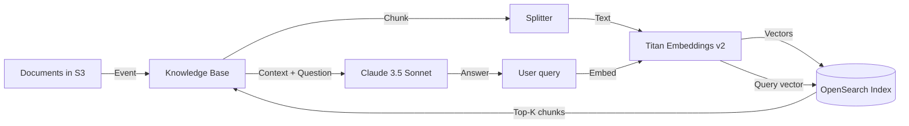

#### Tổng quan

Trong phần này, bạn sẽ tạo một **Bedrock Knowledge Base** hoàn chỉết bao gồm:

* **Vector store:** Amazon OpenSearch Serverless (collection + index)
* **Embedding model:** Amazon Titan Embeddings v2
* **Source data:** S3 bucket chứa tài liệu (PDF, Markdown, HTML, txt)
* **Chunking strategy:** default chunking hoặc semantic chunking tuỳ chọn

Knowledge Base sẽ tự động:
1. Quét S3 bucket định kỳ
2. Tách tài liệu thành các đoạn nhỏ (chunk) theo cấu hình
3. Sinh vector embedding bằng Titan Embeddings v2
4. Lưu vào OpenSearch Serverless index
5. Sẵn sàng phục vụ truy vấn semantic search



---

#### 3.1. Tạo OpenSearch Serverless collection

OpenSearch Serverless yêu cầu một **collection** để lưu trữ vector. Collection có 2 loại:

* **Vector search** — lưu embeddings, dùng cho RAG
* **Searchable text files** — tìm kiếm theo text (chúng ta không dùng)
* **Time series** — log, metric

Bạn tạo collection Vector search với cấu hình Standby disabled (tiết kiệm chi phí cho dev):

1. Mở OpenSearch Service console → **Serverless** → **Collections**.
2. Click **Create collection**, đặt tên `kb-vector-collection`.
3. Loại collection: **Vector search**.
4. Cấu hình network: **Public access** (cho lab/dev). Production nên dùng VPC.
5. Tạo **encryption policy** & **network policy** khi được yêu cầu.
6. Click **Create** → chờ trạng thái **Active** (~2-3 phút).

```json
{
  "Rules": [
    { "ResourceType": "collection", "Resource": ["collection/kb-vector-collection"] }
  ],
  "AWSOwnedKey": true
}
```

#### 3.2. Tạo Vector index trong collection

Sau khi collection Active, mở collection → tab **Indexes** → **Create vector index**:

* Index name: `kb-documents-index`
* Vector field: `bedrock-knowledge-base-default-vector`
* Dimensions: **1024** (chuẩn của Titan Embeddings v2 — KHÔNG chọn sai, sẽ báo lỗi lúc ingest)
* Distance metric: **Cosine**

```json
{
  "settings": {
    "index": {
      "knn": true
    }
  },
  "mappings": {
    "properties": {
      "bedrock-knowledge-base-default-vector": {
        "type": "knn_vector",
        "dimension": 1024,
        "method": { "name": "hnsw", "engine": "faas" }
      },
      "AMAZON_BEDROCK_METADATA": { "type": "text", "index": false },
      "AMAZON_BEDROCK_TEXT_CHUNK": { "type": "text", "index": false }
    }
  }
}
```

#### 3.3. Tạo IAM role cho Knowledge Base

Bedrock cần một service role để truy cập S3 và OpenSearch. Bạn có thể để Bedrock **tự tạo** role khi cấu hình Knowledge Base, hoặc tự tạo trước để kiểm soát tốt hơn.

Role policy cần 2 action chính:

```json
{
  "Version": "2012-10-17",
  "Statement": [
    {
      "Effect": "Allow",
      "Action": [
        "s3:GetObject",
        "s3:ListBucket"
      ],
      "Resource": [
        "arn:aws:s3:::fcaj-bedrock-docs-<your-id>",
        "arn:aws:s3:::fcaj-bedrock-docs-<your-id>/*"
      ]
    },
    {
      "Effect": "Allow",
      "Action": [
        "aoss:APIAccessAll"
      ],
      "Resource": [
        "arn:aws:aoss:ap-southeast-1:<account-id>:collection/*"
      ]
    },
    {
      "Effect": "Allow",
      "Action": [
        "bedrock:InvokeModel"
      ],
      "Resource": [
        "arn:aws:bedrock:ap-southeast-1::foundation-model/amazon.titan-embed-text-v2:0"
      ]
    }
  ]
}
```

Trust policy cho phép Bedrock assume role:

```json
{
  "Version": "2012-10-17",
  "Statement": [
    {
      "Effect": "Allow",
      "Principal": { "Service": "bedrock.amazonaws.com" },
      "Action": "sts:AssumeRole"
    }
  ]
}
```

#### 3.4. Tạo Knowledge Base

1. Mở **Amazon Bedrock** console → **Knowledge bases** → **Create knowledge base**.
2. **Knowledge base details:**
   * Name: `fcaj-workshop-kb`
   * Description: "Knowledge base for FCAJ workshop chatbot"
   * IAM role: chọn role ở bước 3.3 (hoặc để Bedrock tự tạo)
3. **Data source:**
   * Source: **Amazon S3**
   * S3 URI: `s3://fcaj-bedrock-docs-<your-id>/`
   * (tuỳ chọn) Inclusion/Exclusion filter
4. **Embedding model:**
   * Embedding model: **Titan Text Embeddings v2**
   * Dimensions: 1024
   * (V2 hỗ trợ tốt tiếng Việt + tiếng Anh, dimensions 1024 mặc định)
5. **Vector store:**
   * Chọn **Amazon OpenSearch Serverless**
   * Collection & index đã tạo ở bước 3.1, 3.2
   * Vector field: `bedrock-knowledge-base-default-vector`
   * Text field: `AMAZON_BEDROCK_TEXT_CHUNK`
   * Metadata field: `AMAZON_BEDROCK_METADATA`
6. Click **Create knowledge base** → chờ vài chục giây.

#### 3.5. Cấu hình chunking

Trong Knowledge Base vừa tạo, tab **Data source** → chọn S3 source → **Edit**:

* **Chunking strategy:** chọn **Default chunking**
  * Max tokens: 300 (mặc định)
  * Overlap percentage: 20% (giúp giữ ngữ cảnh giữa các chunk)
* Hoặc **Fixed-size chunking** (chia theo token count cố định)
* Hoặc **Hierarchical chunking** (tạo parent + child chunk, phù hợp tài liệu dài có cấu trúc)
* Hoặc **Semantic chunking** (dùng embedding để tách theo ngữ nghĩa — chính xác hơn nhưng tốn thêm chi phí)


Click **Save** để áp dụng.

#### 3.6. Sync dữ liệu từ S3

Sau khi cấu hình xong:

1. Vào Knowledge Base → tab **Data source** → chọn S3 source → click **Sync**.
2. Chờ trạng thái **Sync complete** (vài phút với tài liệu nhỏ, lâu hơn nếu nhiều file).
3. Kiểm tra trong tab **Test** để thử truy vấn ngay trong Console.

```bash
# Hoặc dùng AWS CLI để sync
aws bedrock-agent start-ingestion-job \
  --knowledge-base-id <KB_ID> \
  --data-source-id <DS_ID> \
  --region ap-southeast-1
```

#### 3.7. Test Knowledge Base ngay trong console

Trong Bedrock Console → Knowledge Base → tab **Test**:

1. Chọn model **Claude 3.5 Sonnet** ở dropdown "Select model".
2. Nhập câu hỏi: *"AWS Lambda là gì?"* hoặc *"Tóm tắt tài liệu AWS overview"*.
3. Click **Run**.
4. Quan sát:
   * **Retrieved chunks:** các đoạn văn bản liên quan được retrieve.
   * **Generated answer:** câu trả lời từ Claude.
   * **Source attribution:** trích dẫn nguồn file nào, chunk nào.


Nếu câu trả lời đúng và trích dẫn nguồn chính xác, bạn đã hoàn thành phần Knowledge Base!

#### 3.8. Tự động sync khi upload file mới

Bedrock Knowledge Base hỗ trợ 2 cách sync:

* **On-demand:** bạn phải click Sync thủ công (như bước 3.6)
* **Event-driven:** khi upload/delete object trong S3, Bedrock tự động sync. Bật bằng cách:
  1. Knowledge Base → tab **Data source** → **Edit**
  2. Bật **Auto sync on change**
  3. Bedrock tự tạo EventBridge rule theo dõi S3 events

Với cách này, mỗi khi bạn `aws s3 cp file.pdf s3://...`, Knowledge Base sẽ tự động ingest file mới trong 1-2 phút.

```bash
# Test auto sync: upload file mới
echo "# Tài liệu test cho Knowledge Base

Amazon S3 là dịch vụ lưu trữ object của AWS, cung cấp 99.999999999% (11 nines) độ bền dữ liệu.

S3 hỗ trợ nhiều storage class: Standard, Intelligent-Tiering, Standard-IA, One Zone-IA, Glacier, Glacier Deep Archive." > s3-faq.md

aws s3 cp s3-faq.md s3://fcaj-bedrock-docs-<your-id>/

# Đợi 1-2 phút, thử hỏi trong tab Test:
# "S3 có những storage class nào?"
```

#### 3.9. Theo dõi & debug

* **CloudWatch Logs:** Knowledge Base ghi log ingestion job vào `/aws/bedrock/knowledgebase/...`
* **CloudWatch Metrics:** `Bedrock-KnowledgeBase` namespace có metric `IngestionJobSuccess`, `IngestionJobFailed`.
* **Bedrock console → Data source → Sync history:** xem lịch sử sync, có lỗi gì.

```bash
# Xem log ingestion gần nhất
aws logs tail /aws/bedrock/knowledgebase/<KB_ID> --follow
```

#### Tổng kết phần 5.3

Sau phần này bạn đã có:
* Một **OpenSearch Serverless collection** với vector index 1024 chiều
* Một **Knowledge Base** kết nối S3 + Titan Embeddings v2
* **Tài liệu đã được ingest** và sẵn sàng cho truy vấn
* **Tab Test trong Console** hoạt động, cho ra câu trả lời chính xác

Phần tiếp theo (5.4) sẽ xây dựng **API + Frontend** để user có thể chat với Knowledge Base này qua giao diện web.

#### Tài liệu tham khảo
* [Bedrock Knowledge Base User Guide](https://docs.aws.amazon.com/bedrock/latest/userguide/knowledge-base.html)
* [OpenSearch Serverless Vector Search](https://docs.aws.amazon.com/opensearch-service/latest/developerguide/serverless-vector-search.html)
* [Amazon Titan Embeddings v2](https://docs.aws.amazon.com/bedrock/latest/userguide/titan-embedding-models.html)
* [Bedrock KB Chunking Strategies](https://docs.aws.amazon.com/bedrock/latest/userguide/kb-chunking-parsing.html)