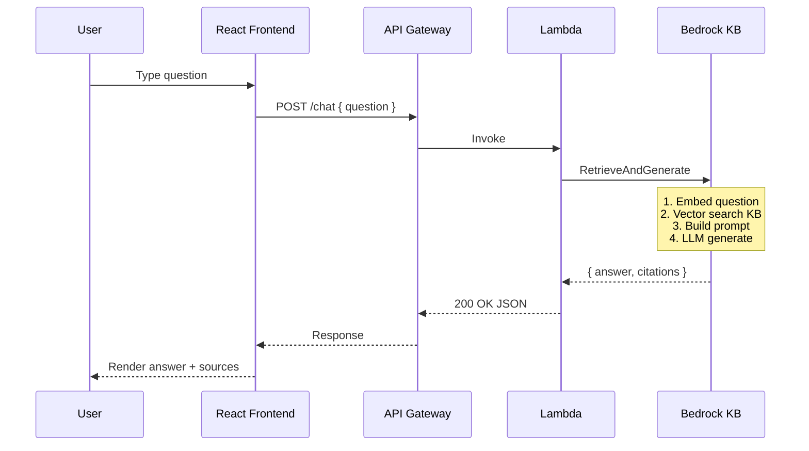

#### Tổng quan

Trong phần này, bạn sẽ xây dựng **backend API** và **frontend chat UI** để user có thể hỏi đáp với Knowledge Base:

* **Backend:** Lambda function (Python 3.12) gọi `RetrieveAndGenerate` API của Bedrock
* **API endpoint:** API Gateway REST API
* **Frontend:** React SPA đơn giản, deploy lên S3 + CloudFront



---

#### 4.1. Tạo Lambda function

Tạo function tên `fcaj-chat-handler` với cấu hình:
* **Runtime:** Python 3.12
* **Architecture:** x86_64
* **Memory:** 256 MB (đủ cho handler đơn giản)
* **Timeout:** 30s (đủ cho retrieve + generate)
* **Environment variables:**
  * `KB_ID`: ID của Knowledge Base tạo ở phần 5.3
  * `MODEL_ARN`: `arn:aws:bedrock:ap-southeast-1::foundation-model/anthropic.claude-3-5-sonnet-20240620-v1:0`
  * `REGION`: `ap-southeast-1`

```bash
# Lấy KB_ID
aws bedrock-agent list-knowledge-bases \
  --query "knowledgeBaseSummaries[?name=='fcaj-workshop-kb'].knowledgeBaseId" \
  --output text --region ap-southeast-1
```

Code Python cho Lambda (`lambda_function.py`):

```python
import json
import os
import boto3
import logging
from botocore.exceptions import ClientError

logger = logging.getLogger()
logger.setLevel(logging.INFO)

bedrock_agent_runtime = boto3.client(
    "bedrock-agent-runtime",
    region_name=os.environ.get("REGION", "ap-southeast-1"),
)

KB_ID = os.environ["KB_ID"]
MODEL_ARN = os.environ["MODEL_ARN"]


def lambda_handler(event, context):
    try:
        # Parse request
        if isinstance(event.get("body"), str):
            body = json.loads(event["body"])
        else:
            body = event

        question = body.get("question", "").strip()
        if not question:
            return _resp(400, {"error": "Missing 'question' field"})

        # Gọi Bedrock KB RetrieveAndGenerate
        response = bedrock_agent_runtime.retrieve_and_generate(
            input={"text": question},
            retrieveAndGenerateConfiguration={
                "type": "KNOWLEDGE_BASE",
                "knowledgeBaseConfiguration": {
                    "knowledgeBaseId": KB_ID,
                    "modelArn": MODEL_ARN,
                    "generationConfiguration": {
                        "inferenceConfig": {
                            "textInferenceConfig": {
                                "maxTokens": 1024,
                                "temperature": 0.3,
                                "topP": 0.9,
                            }
                        }
                    },
                },
            },
        )

        answer = response["output"]["text"]
        citations = []
        for cite in response.get("citations", []):
            for ref in cite.get("retrievedReferences", []):
                loc = ref.get("location", {}).get("s3Location", {})
                citations.append({
                    "uri": loc.get("uri", ""),
                    "title": ref.get("metadata", {}).get("x-amz-bedrock-kb-source-uri", ""),
                })
        # dedup
        seen, uniq = set(), []
        for c in citations:
            if c["uri"] not in seen:
                seen.add(c["uri"])
                uniq.append(c)

        logger.info(f"Question: {question} | Citations: {len(uniq)}")

        return _resp(200, {
            "answer": answer,
            "citations": uniq[:5],  # top 5 sources
        })

    except ClientError as e:
        logger.error(f"Bedrock error: {e}")
        return _resp(500, {"error": str(e)})
    except Exception as e:
        logger.exception("Unhandled error")
        return _resp(500, {"error": str(e)})


def _resp(code, body):
    return {
        "statusCode": code,
        "headers": {
            "Content-Type": "application/json",
            "Access-Control-Allow-Origin": "*",
            "Access-Control-Allow-Headers": "Content-Type",
            "Access-Control-Allow-Methods": "OPTIONS,POST",
        },
        "body": json.dumps(body, ensure_ascii=False),
    }
```

Tạo file deployment:

```bash
mkdir -p chat-handler && cd chat-handler
# Lưu code ở trên vào lambda_function.py
zip -r ../chat-handler.zip lambda_function.py

# Tạo function
aws lambda create-function \
  --function-name fcaj-chat-handler \
  --runtime python3.12 \
  --role arn:aws:iam::<account-id>:role/lambda-bedrock-exec \
  --handler lambda_function.lambda_handler \
  --zip-file fileb://../chat-handler.zip \
  --timeout 30 \
  --memory-size 256 \
  --region ap-southeast-1

# Cấu hình env vars
aws lambda update-function-configuration \
  --function-name fcaj-chat-handler \
  --environment "Variables={KB_ID=<KB_ID>,MODEL_ARN=arn:aws:bedrock:ap-southeast-1::foundation-model/anthropic.claude-3-5-sonnet-20240620-v1:0,REGION=ap-southeast-1}" \
  --region ap-southeast-1
```

#### 4.2. IAM role cho Lambda

Tạo role `lambda-bedrock-exec` với policy:

```json
{
  "Version": "2012-10-17",
  "Statement": [
    {
      "Effect": "Allow",
      "Action": [
        "bedrock:RetrieveAndGenerate",
        "bedrock:Retrieve",
        "bedrock:InvokeModel"
      ],
      "Resource": "*"
    },
    {
      "Effect": "Allow",
      "Action": [
        "logs:CreateLogGroup",
        "logs:CreateLogStream",
        "logs:PutLogEvents"
      ],
      "Resource": "arn:aws:logs:ap-southeast-1:<account-id>:*"
    }
  ]
}
```

Trust policy:

```json
{
  "Version": "2012-10-17",
  "Statement": [
    {
      "Effect": "Allow",
      "Principal": { "Service": "lambda.amazonaws.com" },
      "Action": "sts:AssumeRole"
    }
  ]
}
```

#### 4.3. Tạo API Gateway REST API

1. Mở **API Gateway** console → **Create API** → **REST API**.
2. Đặt tên `fcaj-chat-api`, endpoint type **Regional**.
3. Tạo resource `POST /chat`:
   * Resource name: `chat`
   * Path: `/chat`
   * Method: **POST** → Integration type **Lambda Function** → chọn `fcaj-chat-handler`.
4. Bật **CORS** cho resource: Access-Control-Allow-Origin = `*`.
5. Bật **OPTIONS** method (mock) để xử lý preflight.
6. **Deploy API** → Stage name: `prod`.
7. Copy **Invoke URL** (ví dụ: `https://abc123.execute-api.ap-southeast-1.amazonaws.com/prod`).

```bash
# Test API nhanh
curl -X POST https://abc123.execute-api.ap-southeast-1.amazonaws.com/prod/chat \
  -H "Content-Type: application/json" \
  -d '{"question": "AWS Lambda là gì?"}'
```

Response mẫu:

```json
{
  "answer": "AWS Lambda là dịch vụ compute serverless cho phép bạn chạy code mà không cần quản lý server...",
  "citations": [
    {"uri": "s3://fcaj-bedrock-docs-xxx/aws-overview.pdf", "title": "..."},
    {"uri": "s3://fcaj-bedrock-docs-xxx/lambda-faq.md", "title": "..."}
  ]
}
```

#### 4.4. Xây dựng React Frontend

Tạo SPA React đơn giản với Vite:

```bash
npm create vite@latest fcaj-chat-ui -- --template react
cd fcaj-chat-ui
npm install
```

Sửa file `src/App.jsx`:

```jsx
import { useState } from "react";
import "./App.css";

const API_URL = import.meta.env.VITE_API_URL;

function App() {
  const [messages, setMessages] = useState([
    { role: "assistant", content: "Xin chào! Hỏi tôi bất kỳ điều gì về tài liệu AWS." },
  ]);
  const [input, setInput] = useState("");
  const [loading, setLoading] = useState(false);

  const send = async () => {
    if (!input.trim() || loading) return;
    const userMsg = { role: "user", content: input };
    setMessages((m) => [...m, userMsg]);
    setInput("");
    setLoading(true);

    try {
      const res = await fetch(`${API_URL}/chat`, {
        method: "POST",
        headers: { "Content-Type": "application/json" },
        body: JSON.stringify({ question: userMsg.content }),
      });
      const data = await res.json();
      setMessages((m) => [
        ...m,
        {
          role: "assistant",
          content: data.answer,
          citations: data.citations,
        },
      ]);
    } catch (e) {
      setMessages((m) => [
        ...m,
        { role: "assistant", content: "Lỗi: " + e.message },
      ]);
    } finally {
      setLoading(false);
    }
  };

  return (
    <div className="chat-app">
      <header>
        <h1>🧠 FCAJ Workshop Chat</h1>
        <small>Powered by Amazon Bedrock + RAG</small>
      </header>
      <div className="messages">
        {messages.map((m, i) => (
          <div key={i} className={`message ${m.role}`}>
            <strong>{m.role === "user" ? "You" : "AI"}:</strong> {m.content}
            {m.citations?.length > 0 && (
              <details>
                <summary>📚 {m.citations.length} nguồn</summary>
                <ul>
                  {m.citations.map((c, j) => (
                    <li key={j}>{c.uri}</li>
                  ))}
                </ul>
              </details>
            )}
          </div>
        ))}
      </div>
      <div className="input-row">
        <input
          value={input}
          onChange={(e) => setInput(e.target.value)}
          onKeyDown={(e) => e.key === "Enter" && send()}
          placeholder="Hỏi bất kỳ điều gì..."
          disabled={loading}
        />
        <button onClick={send} disabled={loading}>
          {loading ? "..." : "Gửi"}
        </button>
      </div>
    </div>
  );
}

export default App;
```

Tạo file `.env.production`:

```
VITE_API_URL=https://abc123.execute-api.ap-southeast-1.amazonaws.com/prod
```

CSS đơn giản (`App.css`):

```css
.chat-app { max-width: 800px; margin: 0 auto; padding: 1rem; font-family: system-ui; }
header h1 { margin: 0; }
.messages { display: flex; flex-direction: column; gap: .5rem; margin: 1rem 0; min-height: 60vh; }
.message { padding: .75rem; border-radius: 8px; max-width: 80%; }
.message.user { background: #2563eb; color: white; align-self: flex-end; }
.message.assistant { background: #f1f5f9; align-self: flex-start; }
.input-row { display: flex; gap: .5rem; }
.input-row input { flex: 1; padding: .75rem; border: 1px solid #ddd; border-radius: 8px; }
.input-row button { padding: .75rem 1.5rem; background: #2563eb; color: white; border: 0; border-radius: 8px; cursor: pointer; }
```

#### 4.5. Build & deploy lên S3 + CloudFront

```bash
# Build production
npm run build

# Tạo S3 bucket cho frontend
aws s3 mb s3://fcaj-chat-ui-<your-id> --region ap-southeast-1
aws s3 website s3://fcaj-chat-ui-<your-id> \
  --index-document index.html \
  --error-document index.html

# Upload build
aws s3 sync dist/ s3://fcaj-chat-ui-<your-id>/ --delete

# (Tuỳ chọn) Tạo CloudFront distribution cho HTTPS + caching
aws cloudfront create-distribution \
  --origin-domain-name fcaj-chat-ui-<your-id>.s3.ap-southeast-1.amazonaws.com \
  --default-root-object index.html
```

Mở trình duyệt: `http://fcaj-chat-ui-<your-id>.s3-website-ap-southeast-1.amazonaws.com`

Thử hỏi: *"S3 có những storage class nào?"* → Frontend gọi API → Bedrock retrieve từ KB → Claude trả lời + citation.


#### 4.6. Monitoring

* **CloudWatch Logs của Lambda:** xem log mỗi request, debug nhanh.
* **API Gateway metrics:** số request, 4xx/5xx, latency.
* **Bedrock console → Invocations:** theo dõi token in/out & chi phí.

```bash
aws logs tail /aws/lambda/fcaj-chat-handler --follow
```

#### Tổng kết phần 5.4

Sau phần này bạn có:
* Lambda function gọi Bedrock KB thành công
* REST API công khai qua API Gateway
* React frontend chạy trên S3 + CloudFront
* Toàn bộ pipeline end-to-end: user hỏi → frontend → API → Lambda → Bedrock → KB → trả lời

Phần tiếp theo (5.5) sẽ thêm **Bedrock Guardrails** để lọc nội dung có hại, ẩn PII, và chống prompt injection.

#### Tài liệu tham khảo
* [Bedrock RetrieveAndGenerate API](https://docs.aws.amazon.com/bedrock/latest/APIReference/API_agent-runtime_RetrieveAndGenerate.html)
* [Building a Lambda backend for Bedrock](https://docs.aws.amazon.com/bedrock/latest/userguide/agents-lambda.html)
* [API Gateway + Lambda](https://docs.aws.amazon.com/apigateway/latest/developerguide/getting-started-with-lambda-integration.html)
* [Hosting SPA on S3 + CloudFront](https://docs.aws.amazon.com/AmazonS3/latest/userguide/HostingWebsiteOnS3Setup.html)