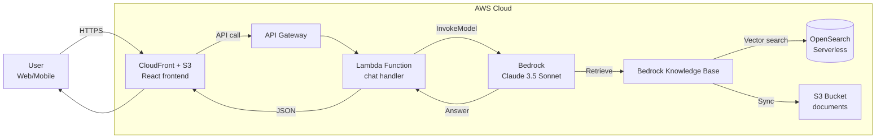

---
title: "Workshop"
date: 2026-04-12
weight: 5
chapter: false
pre: " <b> 5. </b> "
---
# Build a Q&A Chatbot with Amazon Bedrock, Knowledge Base & RAG

#### Overview

**Retrieval Augmented Generation (RAG)** is a technique that combines a large language model (LLM) with an external knowledge base (typically a vector database). When a user asks a question, the system:
1. Retrieves the most relevant chunks from the knowledge base (based on semantic similarity).
2. Injects them into the **context** of the prompt.
3. Lets the LLM generate an answer grounded in the available context, reducing "hallucination".

**Amazon Bedrock** is AWS's fully-managed generative AI service, providing many Foundation Models (Claude, Llama, Titan, Mistral, Cohere). In particular, **Bedrock Knowledge Base** automates the whole RAG pipeline (ingestion → chunking → embedding → retrieval) — you only upload your documents to S3 and Bedrock handles the rest.

In this workshop you will build an internal Q&A chatbot capable of answering questions grounded in your company's documents (e.g. employee handbook, AWS technical docs, internal FAQ), while applying **Guardrails** to ensure safe and compliant outputs.

#### Architecture Overview

#### AWS services used in this workshop
* **Amazon Bedrock** — Foundation Model (Claude 3.5 Sonnet) + Titan Embeddings v2
* **Bedrock Knowledge Base** — automated RAG pipeline
* **Amazon OpenSearch Serverless** — vector database
* **Amazon S3** — source document storage
* **AWS Lambda** — backend chat handler
* **Amazon API Gateway** — REST endpoint for the frontend
* **Amazon CloudFront + S3** — host the SPA frontend (React)
* **Amazon Cognito** — user authentication (optional)
* **Bedrock Guardrails** — filter harmful / PII outputs

#### Workshop outcomes
By the end of this workshop you will have a working RAG chatbot that can answer questions over a custom document set, with logging/auditing, Guardrails for Responsible AI, and full serverless deployment on AWS.

#### Content

1. [Workshop overview](5.1-Workshop-overview/)
2. [Prerequisites](5.2-Prerequiste/)
3. [Build the Knowledge Base with S3 + OpenSearch](5.3-Knowledge-Base/)
4. [Build the Frontend & API (Lambda + API Gateway)](5.4-Frontend-API/)
5. [Bedrock Guardrails (Responsible AI)](5.5-Guardrails/)
6. [Clean up resources](5.6-Cleanup/)