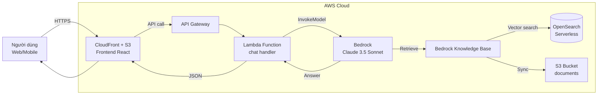

---
title: "Workshop"
date: 2026-04-12
weight: 5
chapter: false
pre: " <b> 5. </b> "
---

# Xây dựng Chatbot Hỏi-Đáp với Amazon Bedrock, Knowledge Base & RAG

#### Tổng quan

**Retrieval Augmented Generation (RAG)** là kỹ thuật kết hợp giữa một mô hình ngôn ngữ lớn (LLM) và một cơ sở tri thức ngoài (thường là vector database). Khi người dùng đặt câu hỏi, hệ thống sẽ:
1. Truy xuất những đoạn tài liệu liên quan nhất từ knowledge base (dựa trên semantic similarity).
2. Đưa những đoạn này vào **context** của prompt.
3. Để LLM sinh câu trả lời dựa trên ngữ liệu có sẵn, giảm hiện tượng "hallucination".

**Amazon Bedrock** là dịch vụ generative AI fully-managed của AWS, cung cấp nhiều Foundation Model (Claude, Llama, Titan, Mistral, Cohere). Đặc biệt, **Bedrock Knowledge Base** tự động hoá toàn bộ pipeline RAG (ingestion → chunking → embedding → retrieval) — giúp lập trình viên chỉ cần upload tài liệu lên S3, mọi phần còn lại Bedrock xử lý.

Trong workshop này, bạn sẽ xây dựng một chatbot hỏi-đáp nội bộ có khả năng trả lời câu hỏi dựa trên tài liệu của công ty (ví dụ: handbook nhân viên, tài liệu kỹ thuật AWS, FAQ nội bộ), đồng thời áp dụng **Guardrails** để đảm bảo đầu ra an toàn và phù hợp.

#### Kiến trúc tổng quan

#### Các dịch vụ AWS sử dụng trong workshop
* **Amazon Bedrock** — Foundation Model (Claude 3.5 Sonnet) + Titan Embeddings v2
* **Bedrock Knowledge Base** — pipeline RAG tự động
* **Amazon OpenSearch Serverless** — vector database
* **Amazon S3** — lưu trữ tài liệu nguồn
* **AWS Lambda** — backend xử lý request chat
* **Amazon API Gateway** — REST endpoint cho frontend
* **Amazon CloudFront + S3** — host SPA frontend (React)
* **Amazon Cognito** — authentication cho user (tuỳ chọn)
* **Bedrock Guardrails** — lọc đầu ra có hại / PII

#### Kết quả đạt được sau workshop
Sau khi hoàn thành, bạn sẽ có một chatbot RAG hoạt động thật, có thể hỏi đáp trên tập tài liệu tuỳ chỉnh, có log/audit, áp dụng Guardrails để đảm bảo Responsible AI, và triển khai hoàn chỉết trên hạ tầng serverless AWS.

#### Nội dung workshop

1. [Tổng quan workshop](5.1-Workshop-overview/)
2. [Các bước chuẩn bị](5.2-Prerequiste/)
3. [Xây dựng Knowledge Base với S3 + OpenSearch](5.3-Knowledge-Base/)
4. [Xây dựng Frontend & API (Lambda + API Gateway)](5.4-Frontend-API/)
5. [Bedrock Guardrails (Responsible AI)](5.5-Guardrails/)
6. [Dọn dẹp tài nguyên](5.6-Cleanup/)